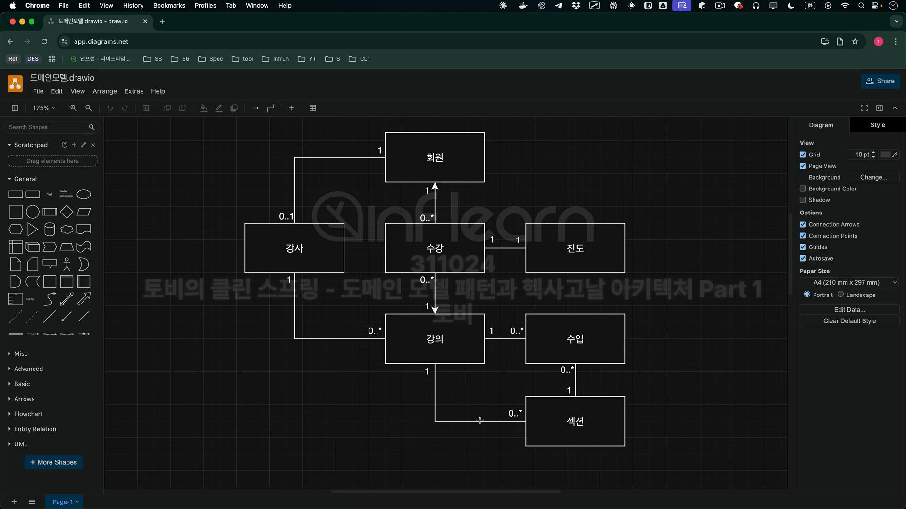

# Splearn 도메인 모델

## 도메인 모델 만들기
1. 듣고 배우기
2. 중요한 것들 찾기 개념 식별
3. 연결 고리 찾기 관계 정의
4. 것들을 설명하기 속성 및 기본 행위 명시
5. 그려보기 시각화
6. 이야기 하고 다듬기 반복

## 도메인 모델

### 회원

### 강사

### 강의

### 수업

### 섹션

### 수강

### 진도

